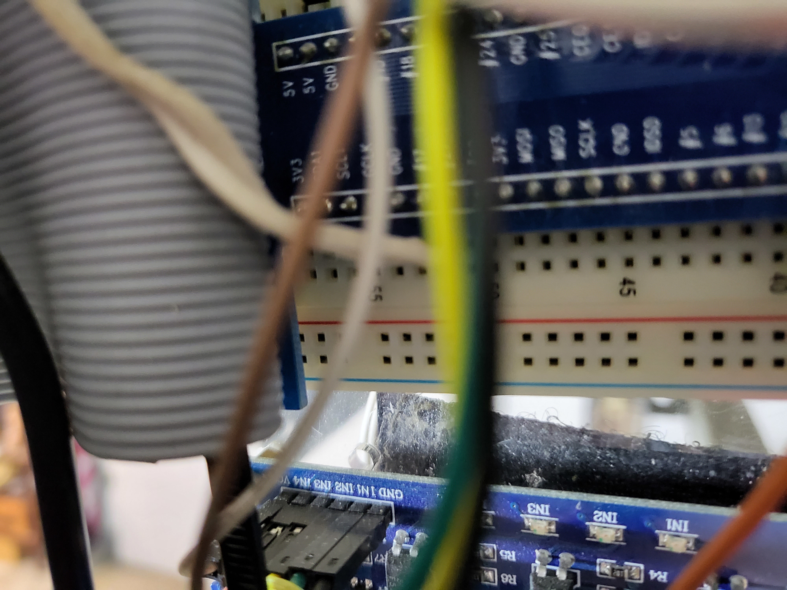
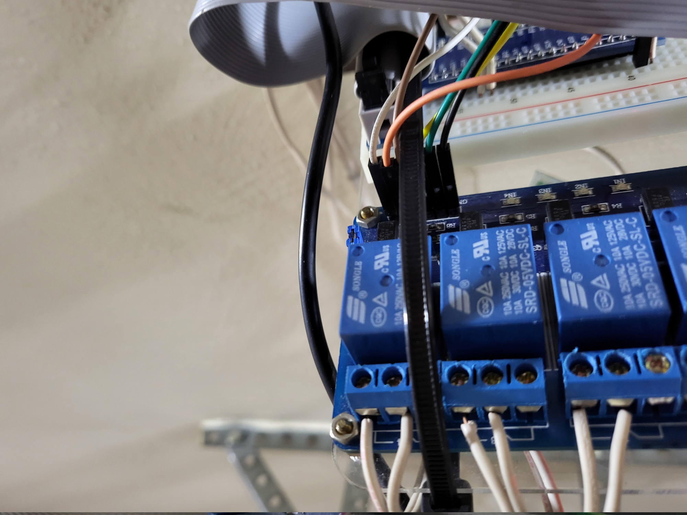
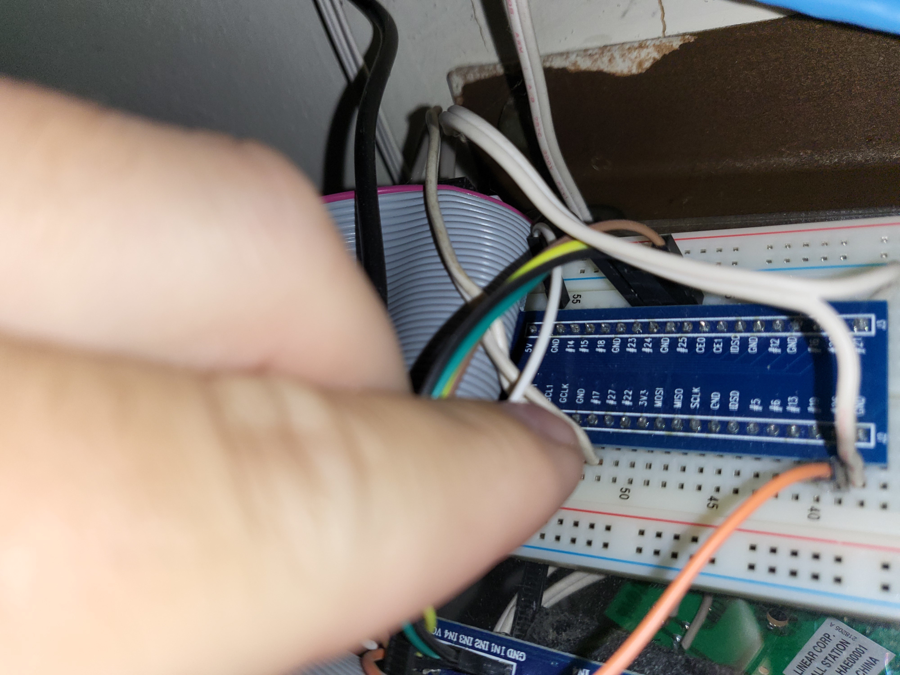

# Wiring up the Components

As mentioned in the "Background" section, I have had mine "mounted" on the ceiling of my garage for over 6 years.  So the pictures I have for wiring it up are with it already in place.

It should be pretty straight forward on how to cable this up, but I will go through it the best I can. Adjust as needed based on the GPIO pins you use.

Also, I used a breadboard to make the connections easier, but it is not necessary.  I used different colored wires to help keep it straight in my head, but that isn't required.

**Note: power should not be plugged into the GaragePi while wiring it up.**

## Connecting the Relays

1. Connect the VCC pin on the relay module, which is the power, to one of the 5V GPIO Pins on the GaragePi
2. Connect each "IN" pin (1-4 or how ever many relays you are using) on the relay module to GPIO pin 23-26 on the GaragePi
    - In my case I have the following:
        - 1IN <--> GPIO pin 23
        - 2IN <--> GPIO pin 24
        - 3IN <--> GPIO pin 25
        - 4IN <--> GPIO pin 26
3. Connect the GND pin to a GND GPIO pin on the GaragePi
4. Connect wires from each relay to the appropriate locaton on your remote or to your garage door opener.
    - When I did mine originally, I solddered the connections to the back side of the controllers on the appropraiate button pins.  It was a bit of trial and error to get the correct pins.
5. *If connecting directly to your door opener(s) or connecting to existing door controller(s), then you don't need to do this step.* Connect wire from door controller to door opener.

*Note: if using an additional garage door controller like I did, you may need to clip off any LED that is on the board.  I found without doing this, it was drawing too much power from the garage door opener that it put it into "vacation" mode and the wireless controllers would not work.*

## Connecting the Sensors

1. Attach the switch part of the sensor (the side that wires connect to) on the wall just above the garage door and the magnet part of the sensor on the top of the door.
2. Connect a wire to NO (for normally open) and to COM (common/ground) on the sensor and connect the other ends to a GPIO GND Pin and GPIO 21 Pin on the GaragePi.  For the second door, if you are using one, connect the GaragePi side to GPIO GND Pin and GPIO 17 Pin.

## Images

Below are a lot of images.  I was trying to get some different angles to help be able to better see how it is connected.  

  
  
  
  
  
  
  
  
  
  
  
  
  

