# Install/Configure Raspberry Pi for GaragePi

## Install and configure Raspberry Pi OS Lite

1. Download and install Imager from [raspberrypi.org](https://www.raspberrypi.com/software).
2. Insert the SD card you want to use for your GaragePi into your computer
    - 8GB or 16GB should be plenty big enough for this.
3. Once Imager is installed, launch it.
    - Note: I am doing this on Ubuntu, but it should be similar on MacOS and Windows  
    
4. Click the **CHOOSE OS** button  
    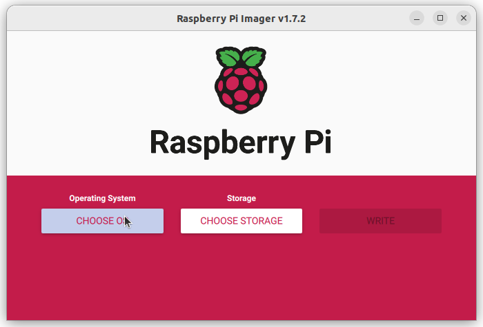
5. Click the **Raspberry Pi OS (other)** option in the list  
    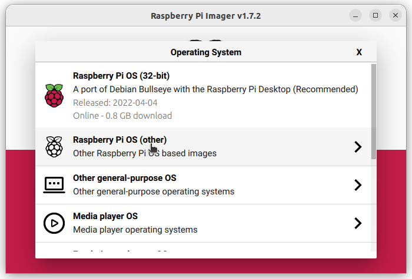
6. Click the **Rasberry Pi OS Lite (32-bit)** option in the list  
    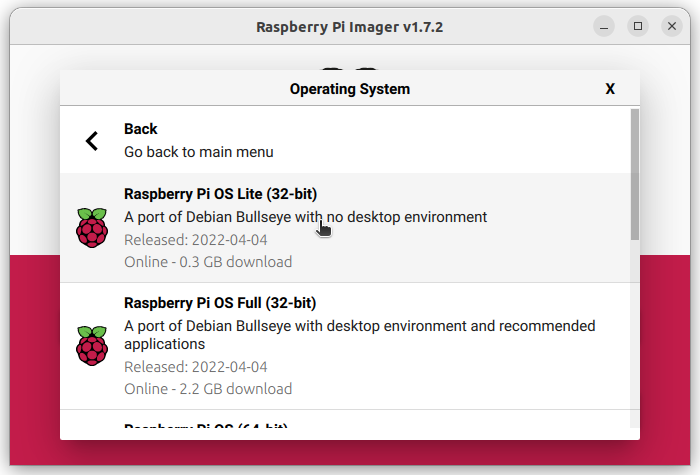
7. Click the **CHOOSE STORA...** button  
    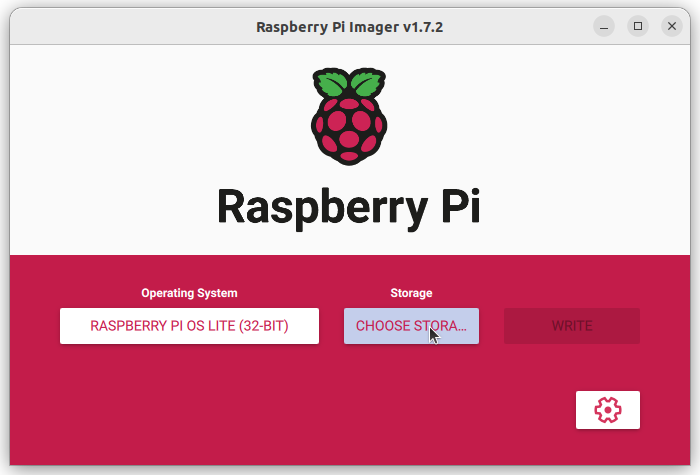
8. Click the SD card you inserted in step 2  
    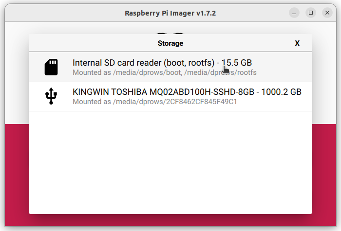
9. Click the **Gear Cog** button  
    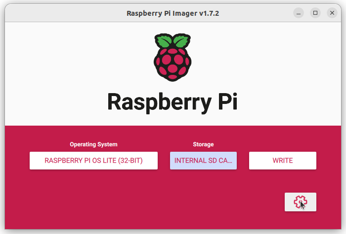
10. Fill out the items in the following images to fit your environment and then click the **SAVE** button.
    - It is important to set all of this up now as it will make it where you don't need to change the configuration once you put it into your RPi.  Make sure you enable SSH, set a username and password, and make note of the username and password as you will need that to SSH into the device.  
    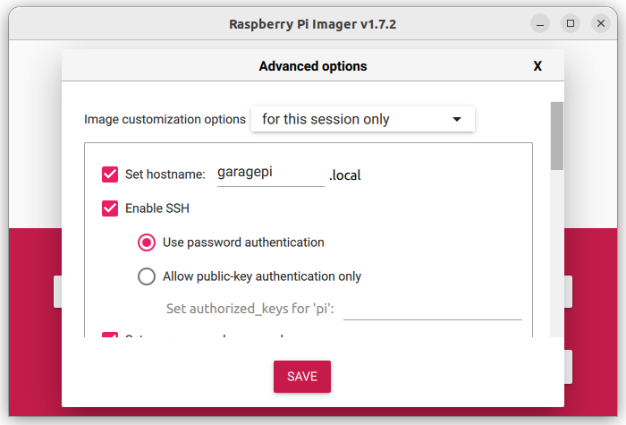  
    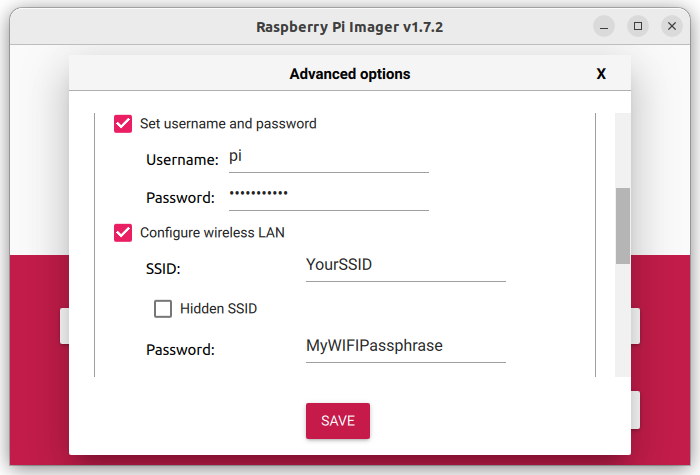  
    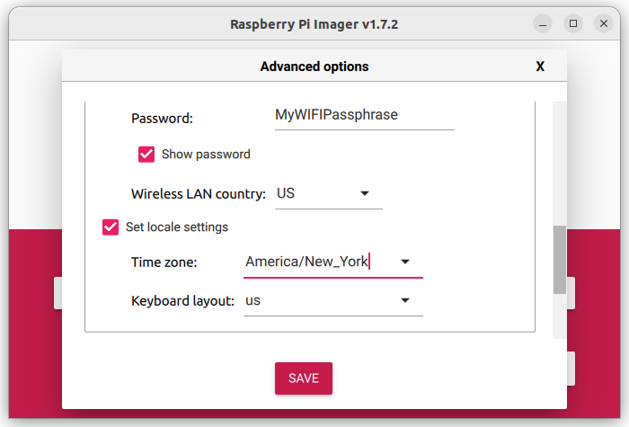  
    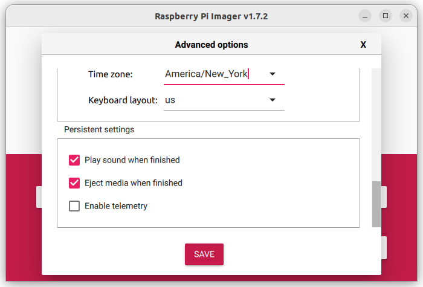  
11. Click the **WRITE** button  
    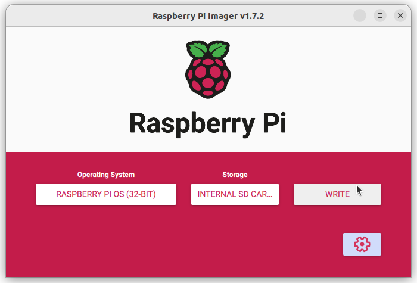
12. Click the **YES** button to confirm you want to continue and erase anything that may exist on the SD card  
    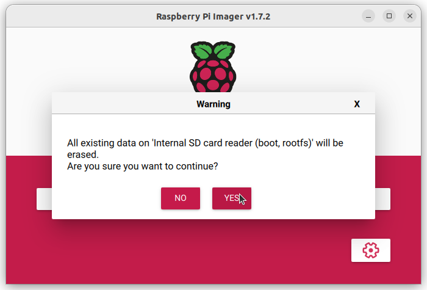
13. It will take a few minutes for the process to complete.  
    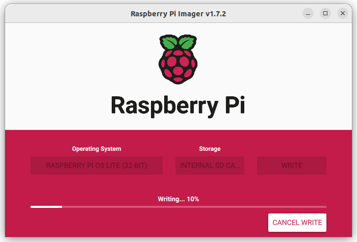
14. Once it has completed, remove the SD card from your computer and click the **CONTINUE** button  
    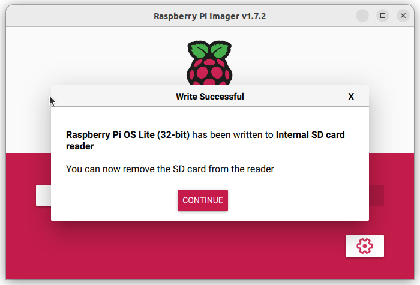
15. Close out of Imager on your computer
16. Put the SD card into your RPi

## Setting up MQTT on the GaragePi

To control the GaragePi with MQTT, we need to install some items on the Pi.  Since we installed Rasberry Pi, there is no GUI (Desktop) to use.  Everything is done through command line (aka shell).  You will need to either connect a keyboard and monitor to the GaragePi or use a Terminal or Putty to SSH into the device.  If you are going to connect a Monitor and Keyboard, then start with step 4.

1. Run the following command in a terminal or putty session, where "ipaddress" is the actual IP address of your GaragePi

    ``` shell
    ssh pi@ipaddress
    ```

2. Enter the **password88 you entered in step 10 above
3. Press **Enter**
4. Run the following commands

    ``` shell
    sudo apt-get update && sudo apt-get dist-upgrade -y
    sudo reboot
    sudo apt-get install supervisor
    sudo apt-get install python-pip
    sudo pip install --upgrade virtualenv
    cd /home/pi
    virtualenv ve
    . ve/bin/activate
    pip install pi-mqtt-gpio
    pip install RPi.GPIO
    ```

5. Configure the pi-mqtt-gpio app by modifying **~/pi-mqtt-gpio.yml**

    ``` shell
    nano ~/pi-mqtt-gpio.yml
    ```

    - Below is my configuration.  You will need to modify it to use your **mqtt_broker_ip** and **mqtt_broker_port** (IP of Home Assistant if following this whole guide and default port of 1883) and **user** and **password** (This would be the username and password we took note of in step 17 of the mqtt setup on Home Assistant)
    - I used GPIO pins 23, 24, 25, and 26 to control the relays.  Two are for the garage door openers and 2 are for the lights on the garage door openers.
    - I used GPIO pins 21 and 17 as inputs for the magnetic switches (to know if the doors are open or closed)

    ``` shell
    mqtt:
      host: mqtt_broker_ip
      port: mqtt_broker_port
      user: "homeassistant"
      password: "page2kaedaecaitei0ooqu8zeiph5jahf3Shee9aedieX2Oophae7rahtheighae"
      topic_prefix: home/garage
      status_topic: status
      status_payload_running: online
      status_payload_stopped: offline
      status_payload_dead: dead
      discovery: on
    
    gpio_modules:
      - name: raspberrypi
        module: raspberrypi
    
    digital_outputs:
      - name: switch23
        module: raspberrypi
        pin: 23 #GPIO 
        on_payload: "ON"
        off_payload: "OFF"
        inverted: true
        initial: high
      - name: switch24
        module: raspberrypi
        pin: 24 #GPIO 
        on_payload: "ON"
        off_payload: "OFF"
        inverted: true
        initial: high
      - name: switch25
        module: raspberrypi
        pin: 25 #GPIO 
        on_payload: "ON"
        off_payload: "OFF"
        inverted: true
        initial: high
      - name: switch26
        module: raspberrypi
        pin: 26 #GPIO 
        on_payload: "ON"
        off_payload: "OFF"
        inverted: true
        initial: high
    digital_inputs:
      - name: sensor21
        module: raspberrypi
        pin: 21 # GPIO 
        on_payload: "ON"
        off_payload: "OFF"
        pullup: yes
        pulldown: no
      - name: sensor17
        module: raspberrypi
        pin: 17 # GPIO 
        on_payload: "ON"
        off_payload: "OFF"
        pullup: yes
        pulldown: no
    ```

6. The next step is to setup pi-mqtt-gpio as a daemon so it will run when the pi is restarted.  To do this, you need to create a supervisor config: **/etc/supervisor/conf.d/pi-mqtt-gpio.conf**

    ``` shell
    sudo nano /etc/supervisor/conf.d/pi-mqtt-gpio.conf
    ```

7. Enter the following

    ``` shell
    [program:pi_mqtt_gpio]
    command = /home/pi/ve/bin/python -m pi_mqtt_gpio.server pi-mqtt-gpio.yml
    directory = /home/pi
    redirect_stderr = true
    stdout_logfile = /var/log/pi-mqtt-gpio.log
    ```

8. Press **Ctrl + X**
9. Press **Y** that you want to save the modified buffer
10. Press **Enter** to confirm the name of the file (keeping the name listed)
11. Update the Supervisor using the follwoing commands:

    ``` shell
    sudo supervisorctl update
    sudo supervisorctl status
    ```

12. To ensure the GPIO pins start up with the right levels, you need to edit **/boot/config.txt** by adding the following at the end of the file:

    ``` shell
    # Custom Setting for GPIO on startup
    # Set GPIO23, 24, 25, and 26 to be an output set to 1
    gpio=23,24,25,26=op,dh
    ```

13. To edit the **/boot/config.txt** file:

    ``` shell
    sudo nano /boot/config.txt
    ```

14. Press **Ctrl + X**
15. Press **Y** that you want to save the modified buffer
16. Press **Enter** to confirm the name of the file (keeping the name listed)

This completes the GaragePi side of the setup.
