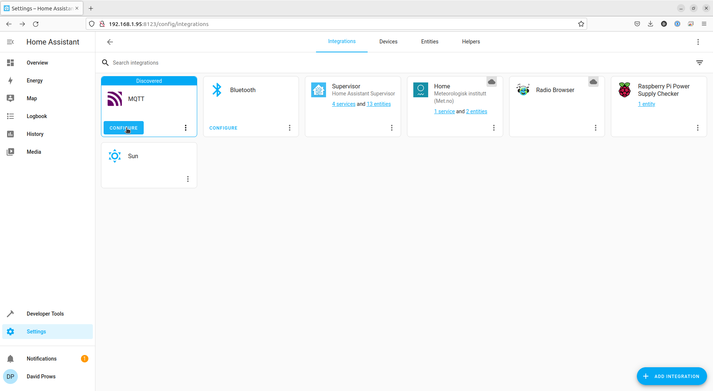
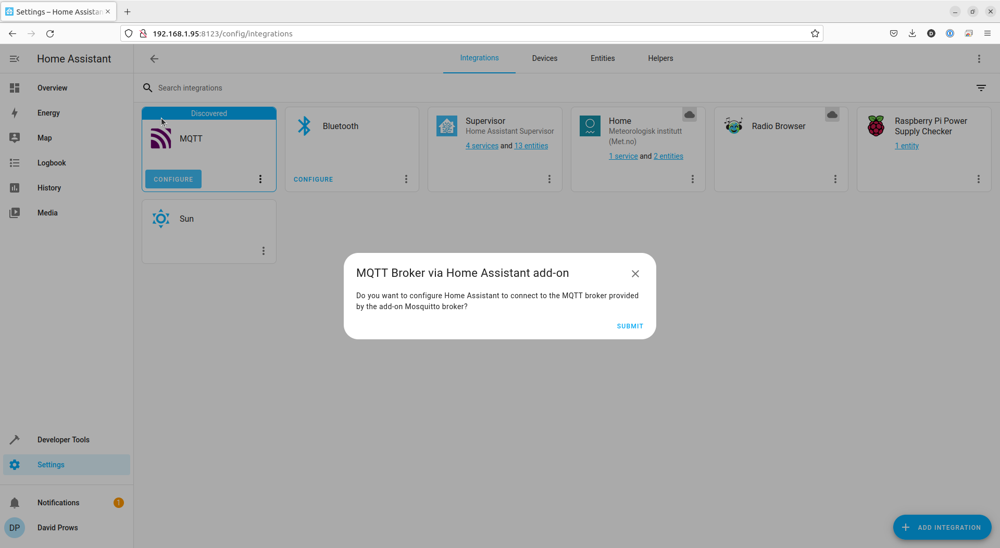

# Install and configure MQTT on Home Assistant

## Setup MQTT

1. Click on **Settings** on the Side bar  
    
2. Click on **Add-ons** in the list of options  
    
3. Click the **ADD-ON Store** button in the bottom right of the window  
    
4. Click in the **Search** field and type **MQTT**
5. Click the **Mosquitto broker** option  
    
6. Click the **INSTALL** link  
    
7. Once it is finished, click the **START** link  
    
8. It only takes a short moment to start  
    
9. Now we need to go and create the integration.  Click **Settings** on the Side bar  
    
10. Click **Devices & Services** in the list of options  
    
11. Click the **Configure** button on the "MQTT" integration
    - If the MQTT integration is not there, click the ADD INTEGRATION button in the bottom right, search for MQTT, and follow the prompts to add it  
    
12. Click the **SUBMIT** link on the MQTT Broker via Home Assistant add-on dialog  
    
13. Click the **FINISH** link on the Success dialog  
    
14. Click the **Configure** link on the Mosquitto broker integration  
    
15. Click the **RE-CONFIGURE MQTT** link under MQTT settings
    - Though Home Assistant already configured MQTT for us, we do not know what the login information is that will need to be used by GaragePi when we set it up.  
    
16. Click the **EYE** icon to reveal the Password  
    
17. Make a note of the Username and Password
    Username: "homeassistant" Password: "page2kaedaecaitei0ooqu8zeiph5jahf3Shee9aedieX2Oophae7rahtheighae" in my case  
    
18. Click the **NEXT** link  
19. Scroll down to the bottom of the MQTT Options dialog and click the **SUBMIT** link  
    
20. Click the **FINISH** link on the Success dialog  
    

We are now done setting up MQTT in Home Assistant.  Move on to configuring the GaragePi
