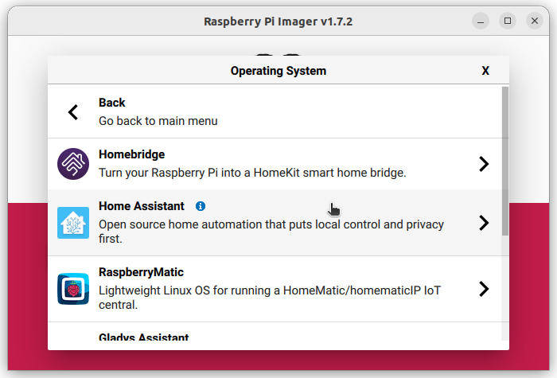
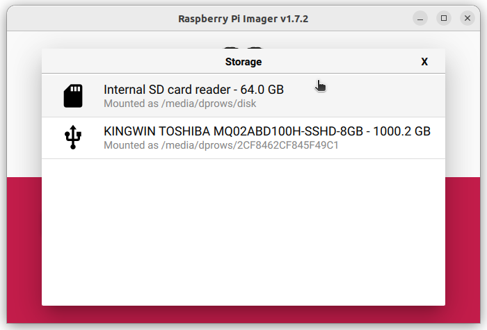

# Setup Home Assistant

This guide is how I setup my Home Assistant initially for my GaragePi usage while on my home network.  There are many videos, blogs, etc. out there for other add-ons and setup information.  Since it is well documented elsewhere, I am not including how to setup external access to Home Assistant.

## Install Home Assistant on Raspberry Pi

1. Download and install ["Imager"](https://www.raspberrypi.com/software/) from raspberrypi.com on your computer.
    - I am using a computer running Ubuntu, but it should be similar on MacOS and Windows.
2. Insert your SD card into your computer
    - You may need an adaptor to do this.
3. Open Imager
    
4. Click the **CHOOSE OS** button
    
5. Click the **Other specific-purpose OS** option in the list (may need to scroll down to find it)
    
6. Click the **Home assistants and home automation** option in the list
    
7. Click the **Home Assistant** option in the list
    
8. Click the **Home Assistant OS** option for the type of Raspberry Pi you are using (I chose the RPi 4/400 option)
    
9. Click the **Internal SD card reader** option in the list (this would be selecting your SD Card to install Home Assistant on to)
    
10. Click the **WRITE** button to start writing Home Assistant to your SD card
    
11. Click the **YES** button to confirm
    
12. This takes a couple minutes depending on your computer.
    
13. When it is completed, remove the SD card from the computer and click **CONTINUE**
    

## Initial Home Assistant Configuration

1. Place the SD card into your RPi
2. Plugin the RPi to power it on
3. I connected a monitor and network cable to my RPi so I could see what IP address it got so I can configure it from a browser.  The IP address you need will be in the field listed as **IPv4 addresses for eth0** or something similar.  In my case, the IP is shown as 192.168.1.95/24, but we will ignore the /24 and just use 192.168.1.95.
4. Now go to a computer on the same network and open a browser (Chrome, Firefox, MS Edge, etc.)
5. In the Address bar, type **http://192.168.1.95:8123**
    - Note: do not put https, but rather http only
    - The **:8123** at the end signifies the port number we are connecting to.  Without that port listed, you would not be able to access the Home Assistant website.
    - It can take a little while for Home Assistant to bootup the first time and be ready for use.  You will see the following until it is ready.  
    
6. Once it is ready to go, you will see the following.  
    
7. Fill in the information requested and make sure to take note of the information as it will be used to login.
8. Click the **CREATE ACCOUNT** button
9. Enter a name you would like for your Home Assistant installation (I left the default of "Home")  
    
10. Fill out **Time Zone**, Select **Metric or Imperial**, and set **Currency** or click the **DETECT** link and let it do it automatically (I clicked DETECT and it worked perfectly for me)
11. Click the **NEXT** link at the bottom
12. Turn On/Off any of the telemetry data you want to send to developers at Home Assistant  
    
13. Click the **NEXT** link at the bottom
14. Click the **FINISH** link at the bottom of the devices found window
15. Initial configuration is complete

I would recommend at this point getting into your router and setting a reservation (sometimes called fixed ip) for your Home Assistant so it keeps the same IP address each time it boots up.
