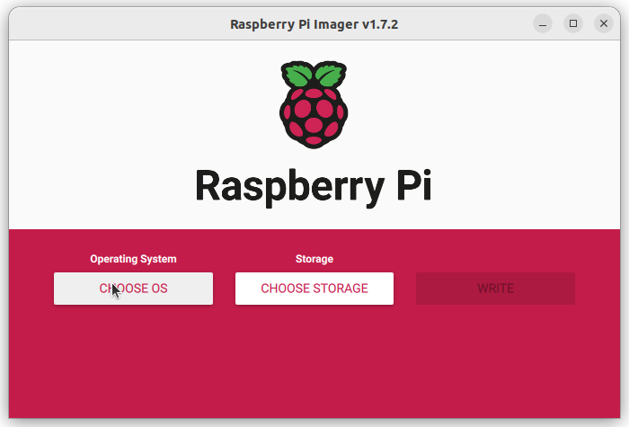
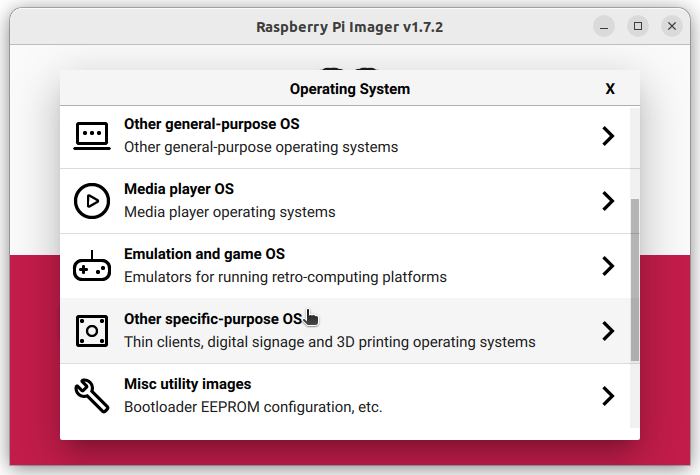
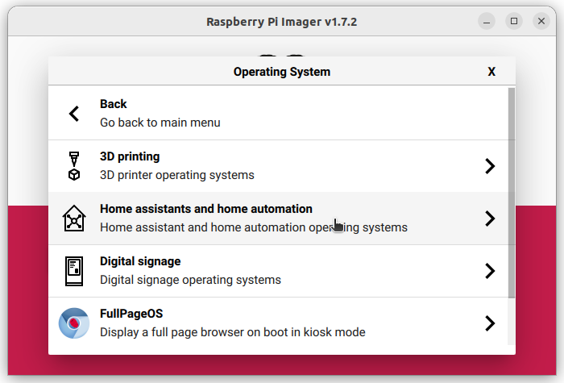
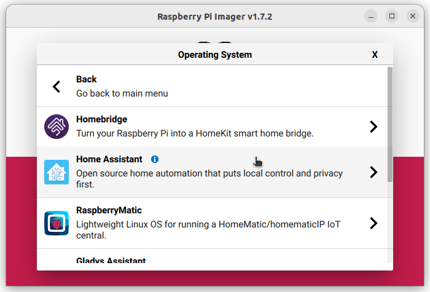
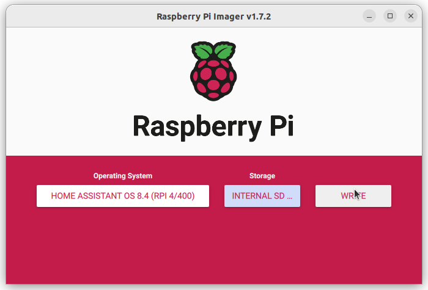
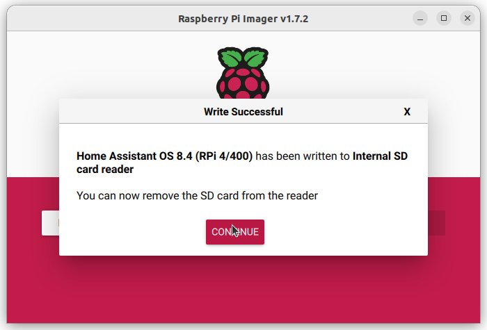

# Setup Home Assistant

This guide is how I setup my Home Assistant initially for my GaragePi usage while on my home network.  There are many videos, blogs, etc. out there for other add-ons and setup information.  Since it is well documented elsewhere, I am not including how to setup external access to Home Assistant.

## Install Home Assistant on Raspberry Pi

1. Download and install ["Imager"](https://www.raspberrypi.com/software/) from raspberrypi.com on your computer.
  - I am using a computer running Ubuntu, but it should be similar on MacOS and Windows.
2. Insert your SD card into your computer
  - You may need an adaptor to do this.
3. Open Imager
  - 
4. Click the **CHOOSE OS** button
  - 
5. Click the **Other specific-purpose OS** option in the list (may need to scroll down to find it)
  - 
6. Click the **Home assistants and home automation** option in the list
  - 
7. Click the **Home Assistant** option in the list
  - 
8. Click the **Home Assistant OS** option for the type of Raspberry Pi you are using (I chose the RPi 4/400 option)
  - 
9. Click the **Internal SD card reader** option in the list (this would be selecting your SD Card to install Home Assistant on to)
  - 
10. Click the **WRITE** button to start writing Home Assistant to your SD card
  - 
11. Click the **YES** button to confirm
  - 
12. This takes a couple minutes depending on your computer.
  - 
13. When it is completed, remove the SD card from the computer and click **CONTINUE**
  - 

## Initial Home Assistant Configuration

1. Place the SD card into your RPi
2. Plugin the RPi to power it on
3. I connected a monitor and network cable to my RPi so I could see what IP address it got so I can configure it from a browser.  The IP address you need will be in the field listed as **IPv4 addresses for eth0** or something similar.  In my case, the IP is shown as 192.168.1.95/24, but we will ignore the /24 and just use 192.168.1.95.
4. Now go to a computer on the same network and open a browser (Chrome, Firefox, MS Edge, etc.)
5. In the Address bar, type **http://192.168.1.95:8123**
  - Note: do not put https, but rather http only
  - The **:8123** at the end signifies the port number we are connecting to.  Without that port listed, you would not be able to access the Home Assistant website.
  - It can take a little while for Home Assistant to bootup the first time and be ready for use.  You will see the following until it is ready.
  - 
6. Once it is ready to go, you will see the following.
  - 
7. Fill in the information requested and make sure to take note of the information as it will be used to login.
8. Click the **CREATE ACCOUNT** button
9. Enter a name you would like for your Home Assistant installation (I left the default of "Home")
  - 
10. Fill out **Time Zone**, Select **Metric or Imperial**, and set **Currency** or click the **DETECT** link and let it do it automatically (I clicked DETECT and it worked perfectly for me)
11. Click the **NEXT** link at the bottom
12. Turn On/Off any of the telemetry data you want to send to developers at Home Assistant
  - 
13. Click the **NEXT** link at the bottom
14. Click the **FINISH** link at the bottom of the devices found window
15. Initial configuration is complete
